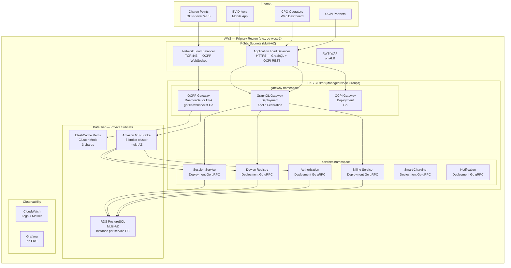

# /api-design Skill

## Purpose
Produce complete, implementation-ready API contracts for all external and internal
interfaces of the CPMS platform.

---

## Pre-flight Check

1. Read `workflow-state.json` and `docs/learnings/architectural-patterns.md`.
2. Require `phases.c4_level_4_data_models.status == "approved"`.
3. Set `phases.api_design.status = "in_progress"` and `started_at = <now>`. Save.

---

## Output File 1: `output/api-design/graphql-schema.md`

Full GraphQL SDL for the external API, organized by domain.

```graphql
# ===== Scalars =====
scalar DateTime
scalar UUID
scalar JSON

# ===== Enums =====
enum SessionStatus {
  ACTIVE
  COMPLETED
  INVALID
}

enum ChargePointStatus {
  AVAILABLE
  PREPARING
  CHARGING
  SUSPENDED_EVSE
  SUSPENDED_EV
  FINISHING
  RESERVED
  UNAVAILABLE
  FAULTED
  UNKNOWN
}

enum StopReason {
  DE_AUTHORIZED
  EMERGENCY_STOP
  EV_DISCONNECTED
  HARD_RESET
  LOCAL
  OTHER
  POWER_LOSS
  REBOOT
  REMOTE
  SOFT_RESET
  UNLOCK_COMMAND
}

# ===== Session Domain =====
type ChargeSession {
  id: ID!
  chargePoint: ChargePoint!
  connector: Connector!
  authToken: String
  authMethod: String!
  startedAt: DateTime!
  stoppedAt: DateTime
  energyWh: Float
  stopReason: StopReason
  status: SessionStatus!
  meterValues(limit: Int, after: DateTime): MeterValueConnection!
  cdr: CDR
}

type MeterValue {
  id: ID!
  timestamp: DateTime!
  measurand: String!
  value: Float!
  unit: String
  phase: String
  context: String
}

type MeterValueConnection {
  nodes: [MeterValue!]!
  pageInfo: PageInfo!
}

# ===== Device Domain =====
type ChargePoint {
  id: ID!
  cpId: String!
  vendor: String
  model: String
  ocppVersion: String!
  status: ChargePointStatus!
  lastHeartbeatAt: DateTime
  location: Location
  connectors: [Connector!]!
  activeSessions: [ChargeSession!]!
}

type Connector {
  id: ID!
  connectorId: Int!
  evseId: Int
  connectorType: String
  status: ChargePointStatus!
  powerType: String
  maxVoltage: Float
  maxAmperage: Float
}

type Location {
  id: ID!
  name: String!
  address: String!
  city: String!
  country: String!
  coordinates: Coordinates!
  chargePoints: [ChargePoint!]!
}

type Coordinates {
  latitude: Float!
  longitude: Float!
}

# ===== Billing Domain =====
type CDR {
  id: ID!
  sessionId: ID!
  startAt: DateTime!
  stopAt: DateTime!
  energyWh: Float!
  totalCost: Float
  currency: String
  paymentStatus: String
}

# ===== Smart Charging =====
type ChargingProfile {
  id: ID!
  profileId: Int!
  purpose: String!
  kind: String!
  unit: String!
  validFrom: DateTime
  validTo: DateTime
  schedule: JSON!
}

# ===== Queries =====
type Query {
  # Session queries
  session(id: ID!): ChargeSession
  sessions(filter: SessionFilter, page: PageInput): SessionConnection!

  # Device queries
  chargePoint(id: ID!): ChargePoint
  chargePoints(locationId: ID, status: ChargePointStatus, page: PageInput): ChargePointConnection!
  location(id: ID!): Location
  locations(page: PageInput): LocationConnection!

  # Billing queries
  cdr(id: ID!): CDR
  cdrs(filter: CDRFilter, page: PageInput): CDRConnection!
}

# ===== Mutations =====
type Mutation {
  # Session control
  startSession(input: StartSessionInput!): StartSessionResult!
  stopSession(sessionId: ID!, reason: StopReason): StopSessionResult!

  # Smart charging
  setChargingProfile(input: ChargingProfileInput!): ChargingProfileResult!
  clearChargingProfile(chargePointId: ID!, profileId: Int): ClearChargingProfileResult!

  # Device management
  changeChargePointAvailability(chargePointId: ID!, type: AvailabilityType!): AvailabilityResult!
  resetChargePoint(chargePointId: ID!, type: ResetType!): ResetResult!
}

# ===== Subscriptions (real-time) =====
type Subscription {
  sessionUpdated(sessionId: ID!): ChargeSession!
  chargePointStatusChanged(locationId: ID): ChargePointStatusEvent!
  meterValueReceived(sessionId: ID!): MeterValue!
  networkStatusFeed(tenantId: ID!): NetworkStatusEvent!
}

# ===== Input types =====
input StartSessionInput {
  chargePointId: ID!
  connectorId: ID!
  authToken: String
}

input ChargingProfileInput {
  chargePointId: ID!
  connectorId: ID
  profile: ChargingProfileData!
}

input SessionFilter {
  chargePointId: ID
  status: SessionStatus
  from: DateTime
  to: DateTime
  authToken: String
}

input PageInput {
  first: Int
  after: String
}
```

---

## Output File 2: `output/api-design/grpc-proto-files.md`

gRPC `.proto` definitions for all internal Go service interfaces.
Produce one proto block per service.

```protobuf
// ===== session_service.proto =====
syntax = "proto3";
package cpms.session.v1;
option go_package = "github.com/cpms/session-service/pkg/proto/session/v1;sessionv1";

import "google/protobuf/timestamp.proto";
import "google/protobuf/empty.proto";

service SessionService {
  rpc GetSession(GetSessionRequest) returns (Session);
  rpc ListActiveSessions(ListActiveSessionsRequest) returns (ListActiveSessionsResponse);
  rpc StartSession(StartSessionRequest) returns (StartSessionResponse);
  rpc StopSession(StopSessionRequest) returns (StopSessionResponse);
  rpc StreamMeterValues(StreamMeterValuesRequest) returns (stream MeterValue);
}

message Session {
  string id = 1;
  string charge_point_id = 2;
  string connector_id = 3;
  string auth_token = 4;
  string auth_method = 5;
  google.protobuf.Timestamp started_at = 6;
  google.protobuf.Timestamp stopped_at = 7;
  double energy_wh = 8;
  string stop_reason = 9;
  SessionStatus status = 10;
  string ocpp_version = 11;
  string tenant_id = 12;
}

enum SessionStatus {
  SESSION_STATUS_UNSPECIFIED = 0;
  SESSION_STATUS_ACTIVE = 1;
  SESSION_STATUS_COMPLETED = 2;
  SESSION_STATUS_INVALID = 3;
}

message StartSessionRequest {
  string charge_point_id = 1;
  string connector_id = 2;
  string auth_token = 3;
  string ocpp_version = 4;
  string tenant_id = 5;
}

message StopSessionRequest {
  string session_id = 1;
  string stop_reason = 2;
  double energy_wh = 3;
  google.protobuf.Timestamp stopped_at = 4;
}
```

Produce equivalent proto files for:
- `device_service.proto` — GetChargePoint, UpdateChargePoint, RecordBootNotification,
  UpdateConnectorStatus, GetConfiguration, SetConfiguration
- `auth_service.proto` — AuthorizeToken, GetLocalAuthList, UpdateLocalAuthList
- `billing_service.proto` — GenerateCDR, GetCDR, ListCDRs, GetTariff
- `smart_charging_service.proto` — SetChargingProfile, ClearChargingProfile,
  GetChargingProfiles, GetCompositeSchedule (OCPP 2.0.1 §K.4)
- `notification_service.proto` — SendPushNotification, SendEmail, SendSMS

---

## Output File 3: `output/api-design/ocpi-endpoint-catalog.md`

OCPI 2.1.1 and 2.2.1 module endpoint inventory with spec citations.

### OCPI 2.2.1 Modules (CPO Role)

| Module | Endpoint | Method | Spec Section | Required |
|--------|----------|--------|--------------|----------|
| Credentials | `/ocpi/2.2.1/credentials` | GET, POST, PUT, DELETE | §6 | Yes |
| Locations | `/ocpi/2.2.1/cpo/locations` | GET (all), GET (one), PATCH | §7 | Yes |
| Sessions | `/ocpi/2.2.1/cpo/sessions` | GET | §9 | Yes |
| CDRs | `/ocpi/2.2.1/cpo/cdrs` | GET, POST | §10 | Yes |
| Tariffs | `/ocpi/2.2.1/cpo/tariffs` | GET, PUT, DELETE | §11 | Yes |
| Tokens | `/ocpi/2.2.1/cpo/tokens` | GET | §12 | Yes (if pull model) |
| Commands | `/ocpi/2.2.1/cpo/commands/{command_type}` | POST (async result) | §13 | Yes |
| ChargingProfiles | `/ocpi/2.2.1/cpo/chargingprofiles/{session_id}` | GET, PUT, DELETE | §14 | If smart charging |

### OCPI 2.1.1 Compatibility

Where OCPI 2.1.1 is also required, document differences:
- 2.1.1 does not have the ChargingProfiles module (§14 was introduced in 2.2)
- 2.1.1 Token push (PATCH `/emsp/tokens`) vs 2.2.1 Token pull (GET `/cpo/tokens`)
- CDR field differences (OCPI 2.2.1 adds `total_parking_cost`, `total_reservation_cost`)

### Authentication
OCPI uses token-based authentication. Document:
- Token A (credentials registration token — one-time)
- Token B (CPO-issued token for eMSP requests to CPMS)
- Token C (eMSP-issued token for CPMS requests to eMSP)
Per OCPI 2.2.1 §4.1.2.

---

## Output File 4: `output/api-design/deployment-architecture.md`

AWS deployment diagram and infrastructure specification.

### Mermaid AWS Deployment Diagram



### draw.io Deployment Diagram
Save as `output/api-design/deployment-architecture.drawio`.
Use AWS architecture icon shapes (`shape=mxgraph.aws4.*`).

### Infrastructure Specification Table

| Component | AWS Service | Configuration | Notes |
|-----------|-------------|---------------|-------|
| EKS Cluster | Amazon EKS | K8s 1.29+, managed node groups | Use Bottlerocket AMI |
| OCPP Gateway nodes | EC2 | c6i.xlarge or similar, dedicated node group | Optimised for WebSocket connections |
| RDS PostgreSQL | Amazon RDS | db.r6g.large, Multi-AZ, per-service DB | Enable Performance Insights |
| Redis | ElastiCache | cache.r6g.large, cluster mode, 3 shards | Enable in-transit encryption |
| Kafka | Amazon MSK | kafka.m5.large, 3 brokers, 3 AZs | MSK Serverless as alternative |
| Load Balancer (OCPP) | NLB | TCP 443, connection draining 300s | Static IP for CP allowlisting |
| Load Balancer (API) | ALB | HTTPS, WAF enabled | Target group per namespace |

---

## After Producing Output

Update `workflow-state.json`:
- `phases.api_design.status = "completed"`, `completed_at = <now>`
- List all output files
- `last_updated = <now>`

Print a congratulations message and full output index. Instruct human to run
`/approve api-design` to close the workflow.
