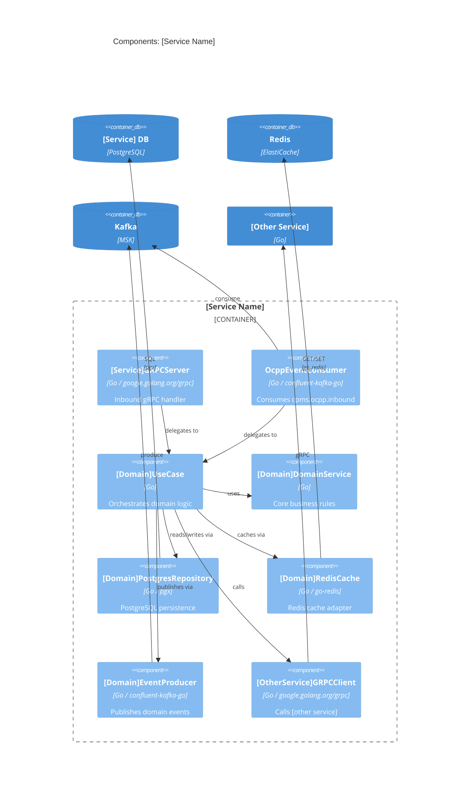
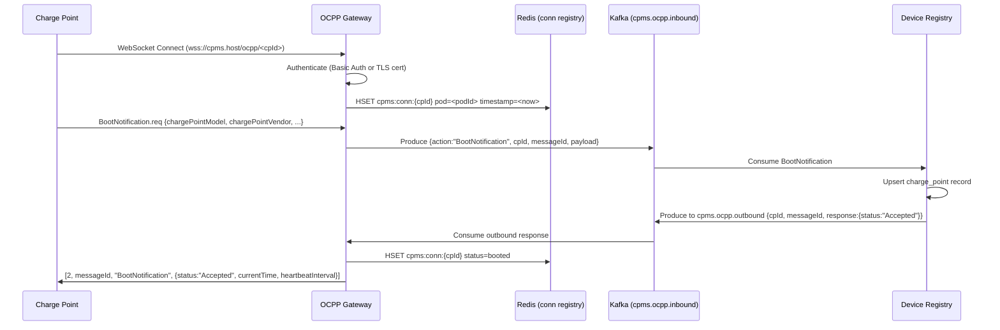

# /c4-component Skill

## Purpose
Produce one Component diagram document per microservice identified in Level 2,
showing each service's internal Hexagonal (Ports & Adapters) structure.

---

## Pre-flight Check

1. Read `workflow-state.json` and `docs/learnings/architectural-patterns.md`.
2. Require `phases.c4_level_2_container.status == "approved"`.
3. Read `services` array from `workflow-state.json` to know which services to document.
4. Set `phases.c4_level_3_component.status = "in_progress"` and `started_at = <now>`. Save.

---

## For EACH Service: Produce `output/c4-level-3-component/<service-slug>-components.md`

And a corresponding `output/c4-level-3-component/<service-slug>-components.drawio`.

---

### Document Structure Per Service

#### Header
```markdown
# C4 Level 3 — Components: [Service Name]

**Date**: YYYY-MM-DD
**Service**: [Service Name]
**Go Module**: [e.g., github.com/cpms/session-service]
**K8s Workload**: [Deployment / DaemonSet / StatefulSet]
**OCPP/OCPI Role**: [brief description]
```

#### Service Overview
- Core responsibility (one paragraph)
- OCPP/OCPI specification context
- Key Go packages used
- External dependencies (databases, Redis, Kafka topics, gRPC clients)

#### Hexagonal Architecture Breakdown

**MANDATORY structure for every service:**

```
┌─────────────────────────────────────────────────────┐
│                   Inbound Adapters                   │
│  gRPC Server Handler │ Kafka Consumer │ HTTP Handler │
├─────────────────────────────────────────────────────┤
│               Application Layer                      │
│        Use Cases / Command Handlers                  │
├─────────────────────────────────────────────────────┤
│                  Domain Core                         │
│     Entities │ Value Objects │ Domain Services       │
│         (zero framework dependencies)                │
├─────────────────────────────────────────────────────┤
│               Outbound Adapters                      │
│  PostgreSQL Repo │ Redis Cache │ Kafka Producer      │
│  gRPC Client (calls to other services)               │
└─────────────────────────────────────────────────────┘
```

#### Component Inventory Table

| Component | Layer | Type | Go Package | Responsibility |
|-----------|-------|------|------------|----------------|

Component types: `MessageHandler`, `CommandHandler`, `UseCase`, `DomainService`,
`Repository`, `Cache`, `KafkaProducer`, `KafkaConsumer`, `GRPCServer`, `GRPCClient`,
`Entity`, `ValueObject`

#### Mermaid C4Component Diagram



#### Critical OCPP Message Flow Sequence Diagrams

For the **OCPP Gateway Service**, always include these flows
(cite the exact OCPP spec section for each):

**1. Charge Point Boot & Registration (OCPP 2.0.1 §7.1 / OCPP 1.6J §4.1)**


**2. RFID Authorize + StartTransaction (OCPP 1.6J §5.1, §5.2 / OCPP 2.0.1 §9.1)**
Include full flow from CP → Gateway → Kafka → Auth Service → Session Service → CP.

**3. MeterValues Streaming (OCPP 2.0.1 §10.3)**
Include flow from CP → Gateway → Kafka → Session Service → Billing Service.

**4. CSMS-Initiated Remote Start (OCPP 2.0.1 §11.1 — RequestStartTransaction)**
Include flow from API call → Session Service → Kafka → Gateway → CP, and CP response.

**5. OCPP 2.0.1 SetChargingProfile (§K.1)** — if Smart Charging is in scope.

For other services, include at least one sequence diagram showing the most complex
or business-critical flow for that service (e.g., for Billing Service: CDR generation
and OCPI CDR push flow).

---

## OCPP Gateway — Additional Detail Required

The OCPP Gateway is the most complex service. Its component document must also include:

**OCPP Version Negotiation** — how the gateway detects whether a CP speaks 1.6J or 2.0.1
(WebSocket sub-protocol header: `ocpp1.6` vs `ocpp2.0.1`) and routes to the appropriate
parser component.

**OCPP 1.6J Compatibility Adapter** — document the adapter component that translates
OCPP 1.6J `RemoteStartTransaction` to the OCPP 2.0.1 `RequestStartTransaction` event
format used internally, so domain services only need to handle one format.

**Connection Affinity in K8s** — explain the Redis-based connection registry mechanism:
when a CSMS-initiated command arrives at any pod, the pod looks up the target CP's
connection in Redis, finds which pod holds that connection, and routes the command
via an internal gRPC call to that pod's local forwarding handler.

---

## After Producing Output

Update `workflow-state.json`:
- `phases.c4_level_3_component.status = "completed"`, `completed_at = <now>`
- List all output files
- `last_updated = <now>`

Print completion message listing all service documents produced, and instruct
human to run `/approve c4-component`.
