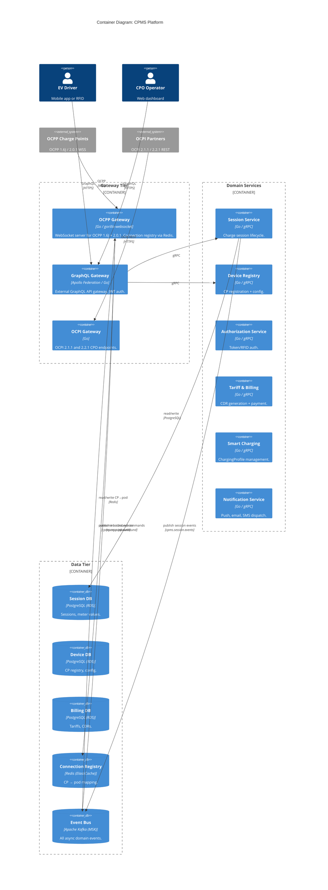

# /c4-container Skill

## Purpose
Produce the C4 Level 2 Container architecture document, mapping all Go microservices,
data stores, messaging infrastructure, and communication channels.

---

## Pre-flight Check

1. Read `workflow-state.json` and `docs/learnings/architectural-patterns.md`.
2. Require `phases.c4_level_1_context.status == "approved"`. If not, tell the human
   to run `/c4-context` and then `/approve c4-context` first.
3. Set `phases.c4_level_2_container.status = "in_progress"` and `started_at = <now>`. Save.

---

## Output Files

### Primary: `output/c4-level-2-container/container-diagram.md`

#### Document Header
Standard header (date, phase, based-on sources, summary paragraph).
Summary: this document is for architects and senior developers; it shows every
deployable unit, data store, and message queue in the CPMS, and how they communicate.

#### Decisions Made
Bulleted list of container-level decisions (e.g., service decomposition boundaries,
data store ownership, Kafka topic design, Redis usage patterns).

#### Container Inventory Table

| Service | Go Module | K8s Workload | Responsibility | OCPP/OCPI Role |
|---------|-----------|--------------|----------------|----------------|

Always include these baseline services (adjust based on requirements):

**Gateway Tier**
- **OCPP Gateway Service** — `gorilla/websocket` + custom OCPP parser; DaemonSet or
  HPA Deployment; manages all OCPP WebSocket connections (1.6J + 2.0.1); authenticates
  charge points; routes OCPP messages to/from Kafka; maintains connection registry in Redis.
  _OCPP role: CSMS endpoint_
- **GraphQL API Gateway** — Apollo Federation router (or Go-based gateway); Deployment;
  routes GraphQL queries/mutations/subscriptions to domain BFF services; handles
  external client authentication via JWT.
- **OCPI Gateway Service** — Go HTTP server; Deployment; implements OCPI 2.1.1 and
  2.2.1 endpoints (Locations, Sessions, CDRs, Tariffs, Tokens, Commands, Credentials);
  handles OCPI partner token authentication.
  _OCPI role: CPO module provider_

**Domain Services (all Go, all gRPC servers)**
- **Session Management Service** — charge session lifecycle; StartTransaction,
  StopTransaction, MeterValues processing; publishes session events to Kafka.
- **Device Registry Service** — charge point registration; BootNotification handling;
  OCPP configuration key management; firmware tracking; publishes device events.
- **Authorization Service** — RFID/token validation; Authorize message handling;
  local auth list management; integration with IdP; caches results in Redis.
- **Smart Charging Service** — ChargingProfile management (OCPP 2.0.1 Smart Charging
  profile); load balancing logic; consumes grid signals; publishes charging commands.
  _(Include only if smart charging is in scope per decisions)_
- **Tariff & Billing Service** — tariff calculation engine; CDR generation at session
  end; payment gateway integration; OCPI CDR push to eMSP partners.
- **Notification Service** — push (APNs/FCM), email, SMS dispatch; consumes
  `cpms.notifications` Kafka topic; fan-out to provider APIs.
- **Reservation Service** — ReserveNow/CancelReservation handling (OCPP 2.0.1
  Reservation profile). _(Include only if reservations are in scope)_

**BFF Layer (include only for UIs that are in scope per decisions.ui_scope)**
- **Operator Dashboard BFF** — Go HTTP/GraphQL server; Backend For Frontend for
  web operator dashboard; aggregates data from domain services via gRPC.
- **Driver Mobile BFF** — Go HTTP/GraphQL server; Backend For Frontend for mobile app;
  handles session start/stop, history, payment, push token registration.
- **Fleet Manager BFF** — Go HTTP/GraphQL server. _(if fleet_portal in scope)_
- **NOC Dashboard BFF** — Go HTTP/GraphQL server; real-time status feeds via
  GraphQL subscriptions. _(if noc_dashboard in scope)_

#### Data Store Inventory Table

| Store | Technology | AWS Service | Owner Service | Purpose |
|-------|-----------|-------------|---------------|---------|
| Session DB | PostgreSQL | RDS | Session Mgmt | Charge session records, meter values |
| Device DB | PostgreSQL | RDS | Device Registry | CP registration, config, firmware |
| Auth DB | PostgreSQL | RDS | Authorization | Auth tokens, local auth list |
| Billing DB | PostgreSQL | RDS | Tariff & Billing | Tariffs, CDRs, payment records |
| OCPI DB | PostgreSQL | RDS | OCPI Gateway | Locations, OCPI tokens, partner credentials |
| CP Connection Registry | Redis | ElastiCache | OCPP Gateway | cpId → pod mapping, OCPP session state |
| Auth Cache | Redis | ElastiCache | Authorization | Token/RFID lookup cache (TTL: 300s) |
| Active Session Cache | Redis | ElastiCache | Session Mgmt | Real-time session state for fast reads |

Note: for multi-tenant deployments, add tenant isolation notes per the strategy
recorded in `decisions.tenant_isolation_strategy`.

#### Kafka Topics Table

| Topic | Producer | Consumers | Key | Retention |
|-------|----------|-----------|-----|-----------|
| `cpms.ocpp.inbound` | OCPP Gateway | Session Svc, Device Registry, Auth Svc, Smart Charging | chargePointId | 7 days |
| `cpms.ocpp.outbound` | Session Svc, Device Registry, Smart Charging | OCPP Gateway | chargePointId | 7 days |
| `cpms.session.events` | Session Svc | Billing Svc, Notification Svc, OCPI Gateway | sessionId | 30 days |
| `cpms.meter.values` | Session Svc | Billing Svc, Smart Charging, (Analytics) | chargePointId | per `decisions.telemetry_retention_days_hot` |
| `cpms.device.status` | Device Registry | NOC BFF (if in scope), Notification Svc | chargePointId | 7 days |
| `cpms.billing.events` | Billing Svc | Notification Svc, OCPI Gateway | sessionId | 30 days |
| `cpms.notifications` | Multiple | Notification Svc | recipientId | 3 days |
| `cpms.smart-charging.commands` | Smart Charging | OCPP Gateway | chargePointId | 1 day |

#### Communication Matrix

| From | To | Protocol | Sync/Async | Note |
|------|----|----------|------------|------|
| Charge Points | OCPP Gateway | OCPP over WSS | Sync (req/res) | CP initiates connection |
| OCPI Partners | OCPI Gateway | REST over HTTPS | Sync | Partner calls CPMS |
| External Clients | GraphQL Gateway | GraphQL/HTTPS | Sync + WebSocket sub | |
| OCPP Gateway | Kafka | Kafka publish | Async | Inbound OCPP events |
| Kafka | OCPP Gateway | Kafka consume | Async | Outbound OCPP commands |
| Domain Services (any → any) | gRPC | gRPC | Sync | Internal only |
| Session/Device/Billing/Smart | Kafka | Kafka publish | Async | Domain events |
| BFFs | Domain Services | gRPC | Sync | BFF aggregates responses |

#### Mermaid C4Container Diagram

Expand with all services and relationships appropriate to the in-scope decisions.

#### draw.io XML
Save as `output/c4-level-2-container/container-diagram.drawio`.
Use `mxgraph.c4.container`, `mxgraph.c4.database`, `mxgraph.c4.person2`,
`mxgraph.c4.systemExternal` shapes. Group containers into swim-lane boundaries
for Gateway Tier, Domain Services, and Data Tier.

#### OCPP/OCPI Design Notes
Cite spec sections for every protocol decision. Always include:
- OCPP Gateway separation rationale (spec reference for CSMS role)
- Kafka routing for OCPP 2.0.1 bidirectional async (justify vs synchronous alternatives)
- Redis connection registry for K8s sticky routing (OCPP WebSocket affinity problem)
- OCPI module decomposition references

#### ADRs to Produce
- `output/decisions/ADR-002-ocpp-gateway-separation.md`
- `output/decisions/ADR-003-kafka-event-backbone.md`
- `output/decisions/ADR-004-redis-connection-registry.md`
- `output/decisions/ADR-005-graphql-federation.md`
- `output/decisions/ADR-006-service-decomposition.md` (why these service boundaries)

---

## After Producing Output

Update `workflow-state.json`:
- `phases.c4_level_2_container.status = "completed"`, `completed_at = <now>`
- `phases.c4_level_2_container.output_files = [list]`
- Populate top-level `services`, `data_stores`, `message_topics` arrays
- Add ADR numbers to `adr_index`
- `last_updated = <now>`

Print completion message and instruct human to run `/approve c4-container`.
