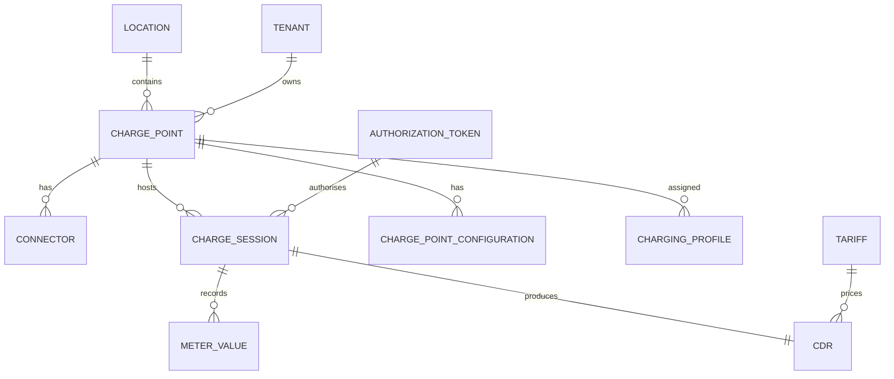

# /data-models Skill

## Purpose
Produce complete data model documentation for all persistent stores, message schemas,
and cache key patterns in the CPMS.

---

## Pre-flight Check

1. Read `workflow-state.json` and `docs/learnings/architectural-patterns.md`.
2. Require `phases.c4_level_3_component.status == "approved"`.
3. Set `phases.c4_level_4_data_models.status = "in_progress"` and `started_at = <now>`. Save.

---

## Output File 1: `output/c4-level-4-data-models/entity-relationships.md`

### Document Header
Summary: this document is for database architects and backend Go developers.
It provides PostgreSQL DDL for every service database, a cross-service conceptual ERD,
and notes on OCPP/OCPI specification alignment.

### Cross-Service Conceptual ERD (Mermaid)

Show the conceptual relationships between entities owned by different services.
Note: actual foreign keys do NOT cross service databases — use UUIDs as correlation IDs.



### Per-Service Table DDL

For each domain service, provide complete PostgreSQL DDL.
Always include:
- `id UUID PRIMARY KEY DEFAULT gen_random_uuid()`
- `created_at TIMESTAMPTZ NOT NULL DEFAULT now()`
- `updated_at TIMESTAMPTZ NOT NULL DEFAULT now()`
- `tenant_id UUID` (if multi-tenant, per `decisions.tenant_isolation_strategy`)
- Appropriate indexes (foreign keys, query patterns)
- Comments citing OCPP/OCPI spec where the field maps to a protocol element

#### Device Registry DB

```sql
CREATE TABLE charge_point (
  id                    UUID PRIMARY KEY DEFAULT gen_random_uuid(),
  cp_id                 VARCHAR(48) NOT NULL,  -- OCPP chargePointIdentity / EVSE serial
  vendor                VARCHAR(50),           -- OCPP 2.0.1 BootNotification.chargingStation.vendorName
  model                 VARCHAR(50),           -- OCPP 2.0.1 BootNotification.chargingStation.model
  serial_number         VARCHAR(25),
  firmware_version      VARCHAR(50),
  ocpp_version          VARCHAR(10) NOT NULL,  -- '1.6J' | '2.0.1'
  status                VARCHAR(32) NOT NULL DEFAULT 'Unknown',
  last_heartbeat_at     TIMESTAMPTZ,
  location_id           UUID,
  tenant_id             UUID NOT NULL,
  created_at            TIMESTAMPTZ NOT NULL DEFAULT now(),
  updated_at            TIMESTAMPTZ NOT NULL DEFAULT now(),
  UNIQUE (cp_id, tenant_id)
);
CREATE INDEX idx_charge_point_tenant ON charge_point(tenant_id);
CREATE INDEX idx_charge_point_status ON charge_point(status);

-- OCPP 2.0.1 introduces EVSE model (§3.2). OCPP 1.6J uses connector numbering.
CREATE TABLE connector (
  id                    UUID PRIMARY KEY DEFAULT gen_random_uuid(),
  charge_point_id       UUID NOT NULL REFERENCES charge_point(id) ON DELETE CASCADE,
  evse_id               INTEGER,               -- OCPP 2.0.1 EVSE.id
  connector_id          INTEGER NOT NULL,      -- OCPP 1.6J connectorId / OCPP 2.0.1 connectorId
  connector_type        VARCHAR(32),           -- IEC 62196 type
  status                VARCHAR(32) NOT NULL DEFAULT 'Unknown',  -- OCPP StatusNotification.status
  power_type            VARCHAR(16),           -- AC_1_PHASE, AC_3_PHASE, DC
  max_voltage           NUMERIC(6,1),
  max_amperage          NUMERIC(6,1),
  tenant_id             UUID NOT NULL,
  created_at            TIMESTAMPTZ NOT NULL DEFAULT now(),
  updated_at            TIMESTAMPTZ NOT NULL DEFAULT now()
);

CREATE TABLE charge_point_configuration (
  id                    UUID PRIMARY KEY DEFAULT gen_random_uuid(),
  charge_point_id       UUID NOT NULL REFERENCES charge_point(id) ON DELETE CASCADE,
  key                   VARCHAR(128) NOT NULL,   -- OCPP 1.6J configurationKey / OCPP 2.0.1 component+variable
  value                 TEXT,
  readonly              BOOLEAN NOT NULL DEFAULT false,
  ocpp_version          VARCHAR(10) NOT NULL,
  component             VARCHAR(64),             -- OCPP 2.0.1 Component.name
  variable              VARCHAR(64),             -- OCPP 2.0.1 Variable.name
  tenant_id             UUID NOT NULL,
  updated_at            TIMESTAMPTZ NOT NULL DEFAULT now(),
  UNIQUE (charge_point_id, key, ocpp_version)
);
```

#### Session Management DB

```sql
CREATE TABLE charge_session (
  id                    UUID PRIMARY KEY DEFAULT gen_random_uuid(),
  charge_point_id       UUID NOT NULL,           -- correlation ID, no FK across services
  connector_id          UUID NOT NULL,
  auth_token            VARCHAR(36),             -- RFID UID or contract ID
  auth_method           VARCHAR(32) NOT NULL,    -- RFID, APP, OCPI_TOKEN, PLUG_AND_CHARGE
  transaction_id        VARCHAR(36),             -- OCPP transactionId (1.6J) or transactionId (2.0.1)
  started_at            TIMESTAMPTZ NOT NULL,
  stopped_at            TIMESTAMPTZ,
  energy_wh             NUMERIC(12, 3),
  stop_reason           VARCHAR(64),             -- OCPP StopTransaction.reason
  status                VARCHAR(32) NOT NULL DEFAULT 'Active',
  ocpp_version          VARCHAR(10) NOT NULL,
  remote_started        BOOLEAN NOT NULL DEFAULT false,
  tenant_id             UUID NOT NULL,
  created_at            TIMESTAMPTZ NOT NULL DEFAULT now(),
  updated_at            TIMESTAMPTZ NOT NULL DEFAULT now()
);
CREATE INDEX idx_session_cp ON charge_session(charge_point_id);
CREATE INDEX idx_session_token ON charge_session(auth_token);
CREATE INDEX idx_session_status ON charge_session(status, tenant_id);

-- OCPP 2.0.1 §10.3: MeterValues are sampled periodically during a session.
CREATE TABLE meter_value (
  id                    UUID PRIMARY KEY DEFAULT gen_random_uuid(),
  session_id            UUID NOT NULL,           -- correlation ID
  charge_point_id       UUID NOT NULL,
  connector_id          UUID NOT NULL,
  timestamp             TIMESTAMPTZ NOT NULL,
  measurand             VARCHAR(64) NOT NULL,     -- OCPP MeterValue.sampledValue.measurand
  phase                 VARCHAR(16),             -- L1, L2, L3, L1-N, L2-N, L3-N
  unit                  VARCHAR(16),             -- Wh, kWh, W, A, V, Celsius, Percent, ...
  value                 NUMERIC(12, 3) NOT NULL,
  context               VARCHAR(32),             -- OCPP: Transaction.Begin, Transaction.End, Sample.Periodic
  location              VARCHAR(32),             -- OCPP: Outlet, Inlet, Body
  tenant_id             UUID NOT NULL,
  created_at            TIMESTAMPTZ NOT NULL DEFAULT now()
);
CREATE INDEX idx_mv_session ON meter_value(session_id, timestamp DESC);
CREATE INDEX idx_mv_cp_time ON meter_value(charge_point_id, timestamp DESC);
```

#### Authorization DB

```sql
-- OCPP 2.0.1 §9.1: Authorization using idToken
CREATE TABLE authorization_token (
  id                    UUID PRIMARY KEY DEFAULT gen_random_uuid(),
  token_uid             VARCHAR(36) NOT NULL,    -- RFID UID or OCPP 2.0.1 idToken.idToken
  token_type            VARCHAR(32) NOT NULL,    -- ISO14443 (RFID), Central, OCPI, ISO15118 (PnC)
  status                VARCHAR(32) NOT NULL,    -- Accepted, Blocked, Expired, Invalid
  expiry_at             TIMESTAMPTZ,
  group_id              VARCHAR(36),             -- OCPP 2.0.1 idToken.groupIdToken
  driver_id             UUID,                    -- correlation to identity service
  tenant_id             UUID NOT NULL,
  created_at            TIMESTAMPTZ NOT NULL DEFAULT now(),
  updated_at            TIMESTAMPTZ NOT NULL DEFAULT now(),
  UNIQUE (token_uid, token_type, tenant_id)
);
```

#### Tariff & Billing DB

```sql
CREATE TABLE tariff (
  id                    UUID PRIMARY KEY DEFAULT gen_random_uuid(),
  name                  VARCHAR(128) NOT NULL,
  currency              CHAR(3) NOT NULL,        -- ISO 4217
  price_per_kwh         NUMERIC(8, 4),
  price_per_minute      NUMERIC(8, 4),
  price_flat            NUMERIC(8, 4),
  valid_from            TIMESTAMPTZ,
  valid_to              TIMESTAMPTZ,
  tenant_id             UUID NOT NULL,
  created_at            TIMESTAMPTZ NOT NULL DEFAULT now(),
  updated_at            TIMESTAMPTZ NOT NULL DEFAULT now()
);

-- OCPI 2.2.1 §10: CDR (Charge Detail Record)
CREATE TABLE cdr (
  id                    UUID PRIMARY KEY DEFAULT gen_random_uuid(),
  session_id            UUID NOT NULL,
  charge_point_id       UUID NOT NULL,
  auth_token            VARCHAR(36),
  start_at              TIMESTAMPTZ NOT NULL,
  stop_at               TIMESTAMPTZ NOT NULL,
  energy_wh             NUMERIC(12, 3) NOT NULL,
  total_cost            NUMERIC(12, 4),
  currency              CHAR(3),
  tariff_id             UUID,
  ocpi_cdr_id           VARCHAR(36),             -- OCPI CDR.id for roaming push
  ocpi_pushed_at        TIMESTAMPTZ,
  payment_intent_id     VARCHAR(128),            -- from payment gateway
  payment_status        VARCHAR(32),
  tenant_id             UUID NOT NULL,
  created_at            TIMESTAMPTZ NOT NULL DEFAULT now()
);
CREATE INDEX idx_cdr_session ON cdr(session_id);
CREATE INDEX idx_cdr_ocpi ON cdr(ocpi_cdr_id) WHERE ocpi_cdr_id IS NOT NULL;
```

#### Smart Charging DB (if in scope)

```sql
-- OCPP 2.0.1 §K.1: ChargingProfile
CREATE TABLE charging_profile (
  id                    UUID PRIMARY KEY DEFAULT gen_random_uuid(),
  charge_point_id       UUID NOT NULL,
  connector_id          UUID,                    -- NULL = applies to whole CP
  profile_id            INTEGER NOT NULL,        -- OCPP ChargingProfile.chargingProfileId
  stack_level           INTEGER NOT NULL DEFAULT 0,
  purpose               VARCHAR(32) NOT NULL,    -- ChargePointMaxProfile, TxDefaultProfile, TxProfile
  kind                  VARCHAR(32) NOT NULL,    -- Absolute, Recurring, Relative
  unit                  VARCHAR(8) NOT NULL,     -- W, A
  valid_from            TIMESTAMPTZ,
  valid_to              TIMESTAMPTZ,
  schedule              JSONB NOT NULL,          -- ChargingSchedule periods
  tenant_id             UUID NOT NULL,
  created_at            TIMESTAMPTZ NOT NULL DEFAULT now(),
  updated_at            TIMESTAMPTZ NOT NULL DEFAULT now()
);
```

### draw.io ERD
Save the cross-service ERD as `output/c4-level-4-data-models/entity-relationships.drawio`.
Use draw.io ER diagram shapes (`shape=table` / `shape=mxgraph.flowchart.entity`).

---

## Output File 2: `output/c4-level-4-data-models/kafka-message-schemas.md`

For each Kafka topic, provide the JSON Schema (draft-07) for the message value.

Example format:
```json
{
  "topic": "cpms.session.events",
  "key": "sessionId (string UUID)",
  "value_schema": {
    "$schema": "http://json-schema.org/draft-07/schema#",
    "type": "object",
    "required": ["eventType", "sessionId", "chargePointId", "timestamp"],
    "properties": {
      "eventType": {
        "type": "string",
        "enum": ["SESSION_STARTED", "SESSION_STOPPED", "SESSION_UPDATED"]
      },
      "sessionId": { "type": "string", "format": "uuid" },
      "chargePointId": { "type": "string" },
      "connectorId": { "type": "string", "format": "uuid" },
      "timestamp": { "type": "string", "format": "date-time" },
      "tenantId": { "type": "string", "format": "uuid" },
      "payload": { "$ref": "#/definitions/sessionPayload" }
    }
  }
}
```

Produce schemas for all topics listed in `workflow-state.json` → `message_topics`.

---

## Output File 3: `output/c4-level-4-data-models/redis-key-schema.md`

Document every Redis key pattern:

| Key Pattern | TTL | Value Type | Owner Service | Purpose |
|-------------|-----|------------|---------------|---------|
| `cpms:conn:{cpId}` | None (refreshed on heartbeat) | Hash | OCPP Gateway | CP→pod mapping: `{pod, connectedAt, ocppVersion}` |
| `cpms:session:active:{cpId}:{connectorId}` | None (deleted on stop) | Hash | Session Service | Active session state for real-time reads |
| `cpms:auth:token:{tokenId}` | 300s | String (JSON) | Authorization | Cached auth result |
| `cpms:auth:local-list:{tenantId}` | None | Set | Authorization | Local auth list token UIDs |
| `cpms:ratelimit:ocpi:{partnerId}` | 60s | Counter | OCPI Gateway | OCPI request rate limiting |

---

## After Producing Output

Update `workflow-state.json`:
- `phases.c4_level_4_data_models.status = "completed"`, `completed_at = <now>`
- List all output files, `last_updated = <now>`

Print completion message and instruct human to run `/approve data-models`.
